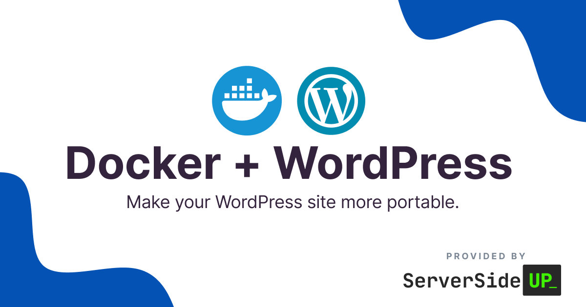

<p align="center">
		
</p>
<p align="center">
	<a href="https://github.com/serversideup/docker-php/blob/main/LICENSE" target="_blank"></a>
	<a href="https://github.com/sponsors/serversideup"></a>
  <br />
  <a href="https://community.serversideup.net"></a>
  <a href="https://serversideup.net/discord"></a>
</p>

# Running WordPress on Docker
Ready to take the dive and modernize WordPress with Docker?

Long story short, it can be definitely be worth it depending on your use case. From our experience, you can save yourself hours, or really over-engineer and dig yourself a hole.

## 👉 "The WordPress Way"
We're very grateful for WordPress, and it even runs our blog for [Server Side Up](https://serversideup.net/). The only downside with WordPress is it has a lot of history with it. That means the core was written with in a mindset before all of the fancy and flashy methods that we have today.

The most important thing you need to remember is always try to do things _"The WordPress Way"_.

The more you work with it, the less you are fighting the platform.

#### What do you mean by "fighting the platform"?
Introducing modern toolsets to WordPress may allow you to get WordPress up and running, but severely limit you to the rest of the community tools.

This could be things like (but not limited to):
* Using NGINX as the web server
* Deploying updates by packaging WordPress into a Docker Image
* Using too new of a PHP version
* Using [Roots Bedrock](https://roots.io/) to modernize your development flow

We've tried all of these above and we learned that most of the plugins that we relied on had issues with this.

# So how does Server Side Up run WordPress?
We embrace these principals:
1. Always do things "The WordPress Way"
1. Keep plugin installation to a minimum
1. Always use Apache as the web server (too many plugins expect Apache)
1. Only commit _your own_ source code (not WordPress core or another plugin)

### The structure
We run WordPress in production on Docker Swarm using:
1. [Traefik](https://traefik.io/traefik/) (handles SSL automatically with Let's Encrypt)
2. [Our PHP-Apache image](https://hub.docker.com/r/serversideup/php/tags?name=fpm-apache&page=1&ordering=-name) (this is optimized for WordPress)
3. [MariaDB](https://hub.docker.com/_/mariadb) (the "non-Oracle" alternative to MySQL)

### Deploying updates
We attempted to deploy WordPress with rolling updates (like we do with Laravel) by packaging WordPress into a Docker image use the[Roots Bedrock](https://roots.io/) framework, but we ran into a ton of issues with community plugins.

Our most stable solution (following "The WordPress Way") is to:
1. Mount `/var/www/html` of the container to the host
2. At the host container, run an SSH `git pull` from our CI system

Ugly, but it works 🤷‍♂️

# Running WordPress Locally with this method
In this repository, you will find a basic boilerplate of what we use when we start a new WordPress project.

### Clone this repo down
```sh
git@github.com:serversideup/docker-wordpress.git
```
### Install WordPress
```sh
# Make sure you are in the project folder
cd docker-wordpress

# Download and extract WordPress
wget -c https://wordpress.org/latest.tar.gz -O - | tar -xz -C public/ --strip=1 wordpress/
```

### Configure your `hosts` file
This example uses "wordpress.dev.test" for the URL, so we would add this to our hosts file:
```
127.0.0.1 wordpress.dev.test
```

### Bring up your containers
We use [Docker Overrides](https://docs.docker.com/compose/extends/) to separate our environments.

For now use this ugly command, but we are working on open sourcing a tool called [Spin](https://github.com/serversideup/spin) that will greatly shorten this:
```sh
docker compose -f docker-compose.yml -f docker-compose.dev.yml up
```

**⚠️ Make sure you allow MariaDB to provision the user the first time.**
You'll see something like this in the logs:
```txt
docker-wordpress-mariadb-1  | [Note] [Entrypoint]: Creating database wordpress
docker-wordpress-mariadb-1  | [Note] [Entrypoint]: Creating user wordpress_database_user
```

### Visit your WordPress site
Just go to [https://wordpress.dev.test/](https://wordpress.dev.test/) in your browser. You should see the WordPress install wizard.

The credentials are set in `docker-compose.dev.yml`. By default they are:
* **Database Name**: wordpress
* **Database Username**: wordpress_database_user
* **Database Password**: wordpress_database_password
* **Database Host**: mariadb (the name of the mariadb service in the docker-compose.yml file)

# Running WordPress in production
We use Docker Swarm for running WordPress in production (just because it is so much simpler than Kubernetes).I  left our `docker-compose.prod.yml` file in there, but there are a number of things that we do in production that would take longer than writing this document 😅

If there is interest on how we do this, just let us know. [Hit me up on Twitter](https://twitter.com/jaydrogers) and express your interest on learning more.

For this first commit, I  just wanted to at least give you a perspective on how we run things.

As always, if you know of a better way, let us know!!

## About Us
We're [Dan](https://twitter.com/danpastori) and [Jay](https://twitter.com/jaydrogers) - a two person team with a passion for open source products. We created [Server Side Up](https://serversideup.net) to help share what we learn.

<div align="center">

| <div align="center">Dan Pastori</div>                  | <div align="center">Jay Rogers</div>                                 |
| ----------------------------- | ------------------------------------------ |
| <div align="center"><a href="https://twitter.com/danpastori"></a><br /><a href="https://twitter.com/danpastori"></a><a href="https://github.com/danpastori"></a></div>                        | <div align="center"><a href="https://twitter.com/jaydrogers"></a><br /><a href="https://twitter.com/jaydrogers"></a><a href="https://github.com/jaydrogers"></a></div>                                       |

</div>

### Find us at:

* **📖 [Blog](https://serversideup.net)** - Get the latest guides and free courses on all things web/mobile development.
* **🙋 [Community](https://community.serversideup.net)** - Get friendly help from our community members.
* **🤵‍♂️ [Get Professional Help](https://serversideup.net/professional-support)** - Get video + screen-sharing support from the core contributors.
* **💻 [GitHub](https://github.com/serversideup)** - Check out our other open source projects.
* **📫 [Newsletter](https://serversideup.net/subscribe)** - Skip the algorithms and get quality content right to your inbox.
* **🐥 [Twitter](https://twitter.com/serversideup)** - You can also follow [Dan](https://twitter.com/danpastori) and [Jay](https://twitter.com/jaydrogers).
* **❤️ [Sponsor Us](https://github.com/sponsors/serversideup)** - Please consider sponsoring us so we can create more helpful resources.

## Our products
If you appreciate this project, be sure to check out our other projects.

### 📚 Books
- **[The Ultimate Guide to Building APIs & SPAs](https://serversideup.net/ultimate-guide-to-building-apis-and-spas-with-laravel-and-nuxt3/)**: Build web & mobile apps from the same codebase.
- **[Building Multi-Platform Browser Extensions](https://serversideup.net/building-multi-platform-browser-extensions/)**: Ship extensions to all browsers from the same codebase.

### 🛠️ Software-as-a-Service
- **[Bugflow](https://bugflow.io/)**: Get visual bug reports directly in GitHub, GitLab, and more.
- **[SelfHost Pro](https://selfhostpro.com/)**: Connect Stripe or Lemonsqueezy to a private docker registry for self-hosted apps.

### 🌍 Open Source
- **[AmplitudeJS](https://521dimensions.com/open-source/amplitudejs)**: Open-source HTML5 & JavaScript Web Audio Library.
- **[Spin](https://serversideup.net/open-source/spin/)**: Laravel Sail alternative for running Docker from development → production.
- **[Financial Freedom](https://github.com/serversideup/financial-freedom)**: Open source alternative to Mint, YNAB, & Monarch Money.